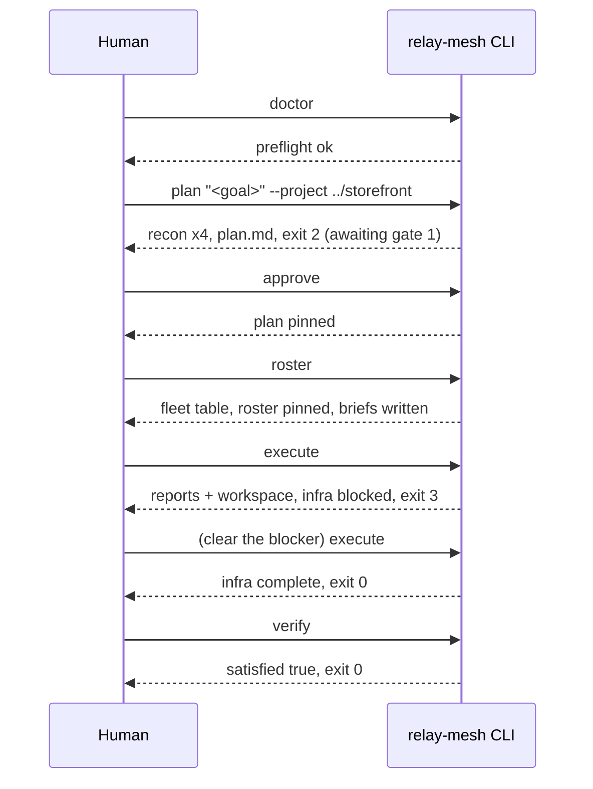

# Walkthrough

Back to [[Relay Mesh Reference]].

An end-to-end run, from goal to verified outcome. The goal here is adding magic-link login to a storefront. Commands and shapes follow the tool exactly. See [[The Command Loop]] for each command and [[The Two Gates]] for the approvals.

## Terminal one, driving the loop

```
$ npx relay-mesh doctor
  env ok . key ok . prompts ok . model slugs validated

$ npx relay-mesh plan "Add magic-link login to the storefront" --project ../storefront
  recon: 4 profiles running (backend, frontend, business, vision)
  synthesis: plan written -> relay/rounds/r001/plan.md
  awaiting approval

$ less relay/rounds/r001/plan.md      # read it, edit it if you like

$ npx relay-mesh approve              # gate 1
  round r001 . type approve to proceed: approve
  approved. next: relay-mesh roster

$ npx relay-mesh roster               # gate 2, review the fleet table, then approve
  round r001 . type approve to proceed: approve
  roster approved. briefs written: backend, frontend, infra
```

## Terminal two, watching the fleet

Run a read-only watcher while execute runs. This is a good place to use a fast, cheap advisor model. See [[Steering Models Across Phases]].

```
$ npx relay-mesh watch
  r001 executing
  planner__backend    partial   3/5
  planner__frontend   complete  4/4
  planner__infra      blocked   1/3
```

## Back in terminal one, finishing the round

```
$ npx relay-mesh execute
  exec done. blocked areas: infra          (exit 3, read the report, clear it, re-run)

$ npx relay-mesh verify
  satisfied: true                          (exit 0)
```

## The session as a sequence



## Three things to remember mid-run

**Resume is just re-running.** There is no daemon and no hidden state. A killed `execute` re-run picks up exactly the pairs that never finished. See [[The Command Loop]].

**Blocked is not a failure.** Exit code 3 means an agent held work for your clearance. Read the area's report, resolve the blocker (often a missing file the executor could not see), and re-run `execute`. Only pairs without a parseable report re-launch. The `relay-mesh-readouts` skill in [[The Skill Pack]] covers clearing a blocked outcome.

**Artifacts are quarantined.** Executors write proposed files to `rounds/rNNN/workspace/<area>/files/`, never to your live repo. You adopt the work deliberately:

```bash
git diff --no-index ../storefront/src relay/rounds/r001/workspace/backend/files/src
```

Malformed executor output earns one corrective re-prompt. If it is still malformed, the verbatim text is preserved at `workspace/<area>/raw.md` and a `status: partial` report is synthesized. Tokens are never lost, and parsing never crashes a phase.

## Splitting across machines

Because each pair has exactly one writer, you can split execution. Run `execute --area backend` on one host and `execute --area frontend --area infra` on another, over a shared root (syncthing or NFS). See the single-writer table in [[Reference Cheatsheet]].
