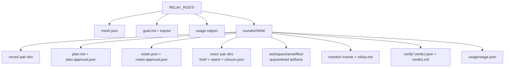

# Core Concepts

> [!info] Back to [[Relay Mesh Reference]]

The vocabulary you need before reading [[The Command Loop]] and [[The Two Gates]]. Every term here maps to something concrete on disk.

## Glossary

| Concept | Meaning |
|---|---|
| profile | One named agent configuration in `profiles.json`: role, domain, model env slot, effort, prompt file. The fleet is data, not code. |
| relay pair | A directory named `<from>__<to>`, for example `planner__backend`, holding one brief and report exchange. A sharded domain adds a `__w<i>` suffix, for example `planner__backend__w1`. |
| roster | `roster.json`, the execute-stage fleet for a round: per domain a template (persona), a worker count, a model slot, and an effort. Advisor authored or default authored, then human approved at gate 2. The sole authority for the executor fan-out. It can mint new domains and shard a domain across workers. |
| brief | The pair's inbox. The gate 2 command materializes it, the executor reads it first. |
| report | The executor's only output channel. It must open with a flat YAML status block. A report whose block does not parse is in-flight, not authoritative. |
| status block | The YAML header on a report: `area`, `status` (complete, partial, or blocked), `steps_done`, `steps_total`, `plan_ref`. |
| closure | `closure.json`, a deterministic roll-up of every report in a pair directory. No AI involved, pure arithmetic. |
| round | `rounds/rNNN/`, one full pass of the loop. Append only: nothing in a finished round is rewritten, fixes go in the next round. |
| blocked | A first-class outcome (exit code 3), not a failure. Work is held for operator clearance. The tool surfaces it distinctly and never restyles it as an error. See [[The Command Loop]] for exit codes. |

## Roles

A profile's `role` is one of `planner`, `recon`, `executor`, `monitor`, or `verifier`. Validation enforces exactly one planner, one monitor, and one verifier, unique names, and unique executor areas among concrete (non-template) executors. The stock fleet is ten profiles, listed in [[Reference Cheatsheet]].

Recon domains are fixed in `profiles.json` and chosen before you run `plan`. The execute fleet is decided later, by the roster, which can mint new domains from any executor template and shard a domain across up to sixteen workers.

## On-disk layout

Everything lives under `RELAY_ROOT` (default `./relay`). Paths are the contract, and the phase of a run is derived entirely from what exists here.



> [!note]
> Every write goes to a `.part` file first, then an atomic rename, so a visible file is always complete. Readers ignore `*.part` and dot-prefixed entries. This is what makes a shared root safe across machines with no locks. See [[Reference Cheatsheet]] for the single-writer table and the multi-machine split.

## The status block

Every report opens with a block like this. If it does not parse, the pair is treated as still running.

```yaml
---
area: backend
status: complete
steps_done: 5
steps_total: 5
plan_ref: rounds/r001/plan.md
---
```

`closure.json` is pure arithmetic over these blocks: per brief `pct = floor(steps_done * 100 / steps_total)`, totals from the sums, plus the list of blocked areas.
