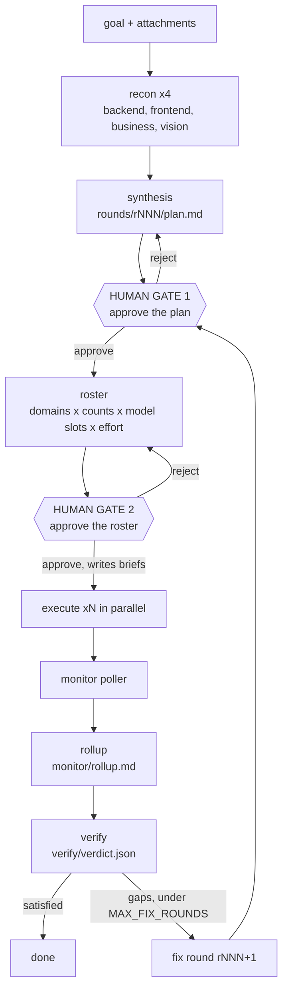

# Relay Mesh Reference

A field guide to operating **relay-mesh**, the parallel-workstream orchestrator, and the **relay-mesh-agent-skills** pack that teaches a coding agent to drive it. This vault covers what the tool is, the command loop, the two human gates, how the skills steer each phase, and how the Claude models (Sonnet 5, Opus 4.8, Fable 5) map onto the work.

relay-mesh has two brains. The **advisor** is your Claude Code session running the skills, the thing that proposes a plan and a roster and types the commands. The **worker fleet** is a set of agents on open-weight models, called through OpenRouter, that do the actual inference. You steer both, and the model choice for both is always yours.

## The whole loop at a glance

## Read next

- [[What Is Relay Mesh]] — The one-page mental model and the two-brain split.
- [[Core Concepts]] — Profile, relay pair, roster, brief, report, closure, round, blocked.
- [[The Command Loop]] — Every command, the phase machine, and the exit codes.
- [[The Two Gates]] — Why nothing runs without a human keystroke, twice.
- [[The Skill Pack]] — The four skills and which phase each one steers.
- [[Steering Models Across Phases]] — Where Sonnet 5, Opus 4.8, and Fable 5 fit.
- [[Walkthrough]] — An end-to-end run, from goal to verified outcome.
- [[Reference Cheatsheet]] — Exit codes, model slots, stock profiles, quick lookup.

## The one rule to keep

> [!important]
> The advisor proposes, the human disposes. The advisor may author exactly two files, each before its gate: `rounds/rNNN/plan.md` and `rounds/rNNN/roster.json`. It never writes an approval file, never approves a gate, and never sets a concrete model id. See [[The Two Gates]].
