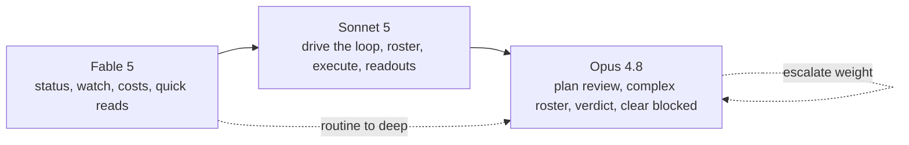
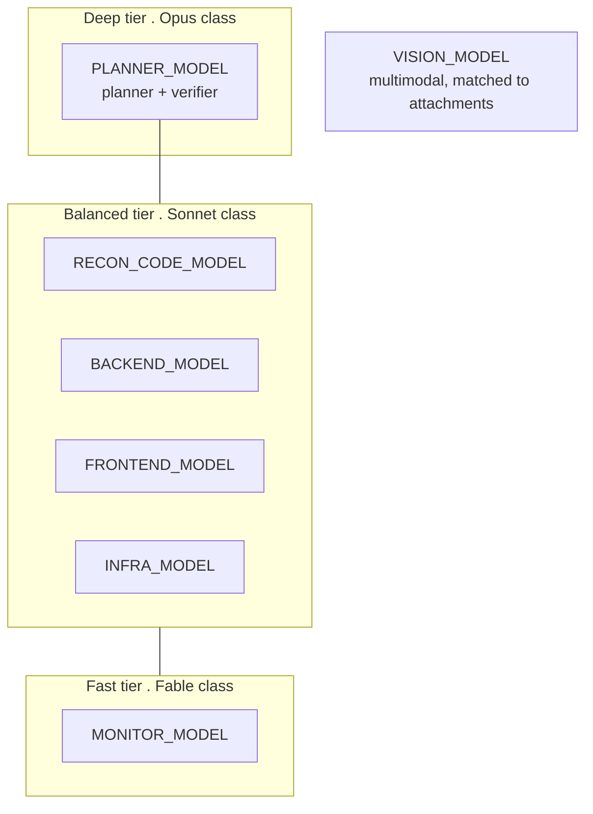

# Steering Models Across Phases

Back to [[Relay Mesh Reference]].

This is the note the whole vault builds toward. It answers one question: where do Sonnet 5, Opus 4.8, and Fable 5 fit in a relay-mesh run, and how do the skills help you steer them.

## The honest starting point

Neither relay-mesh nor the skill pack hard-wires any Claude model to any phase. The skills are worker-neutral and name no model at all. The engine resolves worker models only from `.env`, by slot name. So the mapping below is operator guidance, not tool behavior. It is a recommended default you can adopt and then tune. What the tool guarantees is that the choice is always yours, at two seams.

The two seams line up with the two brains from [[What Is Relay Mesh]]:

- **Layer 1, the advisor session.** Which Claude model runs your Claude Code session while it drives a given phase.
- **Layer 2, the worker slots.** Which model each `.env` slot resolves to for the fleet the run fans out to.

## Layer 1 . The advisor session model

The advisor is the brain reading recon output, drafting the plan and roster, judging the verdict, and clearing blockers. Match the model to the cognitive weight of the phase. This is guidance, not a rule.

| Advisor model | Best for these phases and tasks | Why |
|---|---|---|
| **Opus 4.8** (1M context) | Gate 1 plan review and synthesis judgement, authoring a complex or sharded roster, reading `verdict.json` on a nuanced miss, clearing a hard blocked outcome, planning a fix round. | Deepest reasoning and the largest context window, so it can hold four recon briefs plus the goal plus source files and still reason about tradeoffs. Use it where a wrong call is expensive. |
| **Sonnet 5** | The default driver for the whole loop, routine roster authoring, supervising `execute`, standard readouts. | Balanced speed, cost, and reasoning. This is the workhorse you run most of the time. |
| **Fable 5** | Fast glance work: `status` and `watch` polling, `costs` checks, quick `closure.json` reads, skimming the monitor rollup. | Fastest and cheapest. Ideal for the high-frequency, low-judgement checks you do many times per run. |

A practical pattern: run the session on Sonnet 5 by default, switch up to Opus 4.8 at gate 1 and gate 2 for a large or ambiguous goal, and drop to Fable 5 in a second terminal that only runs `watch` and `status`.

## Layer 2 . The worker slots

The worker fleet's models come from seven `.env` slots, assigned per domain in `roster.json` and per profile in `profiles.json`. The `relay-mesh-roster` skill helps you assign a slot to each domain, but you set what each slot resolves to. The stock defaults are open-weight models. OpenRouter also serves Anthropic models, so a slot can be pointed at a Claude model when you want a Claude worker. See [[Reference Cheatsheet]] for the full slot table and defaults.

| Slot | Used by (phase) | Stock open-weight default | Suggested Claude tier if you want a Claude worker |
|---|---|---|---|
| `PLANNER_MODEL` | planner synthesis, recon-business, verifier | `z-ai/glm-5.2` | Opus 4.8 class, deep synthesis and verdict |
| `RECON_CODE_MODEL` | recon-backend, recon-frontend | `deepseek/deepseek-v4-pro` | Sonnet 5 class, fast code reconnaissance |
| `VISION_MODEL` | recon-vision (multimodal) | `google/gemma-4-26b-a4b-it` | a multimodal model that reads your attachments |
| `BACKEND_MODEL` | exec-backend | `z-ai/glm-5.2` | Sonnet 5 class, balanced coder |
| `FRONTEND_MODEL` | exec-frontend | `moonshotai/kimi-k2.7-code` | Sonnet 5 class, balanced coder |
| `INFRA_MODEL` | exec-infra | `z-ai/glm-5.2` | Sonnet 5 class, balanced coder |
| `MONITOR_MODEL` | monitor rollup | `google/gemma-4-31b-it` | Fable 5 class, cheap and fast for high-volume polling narration |

The tiering logic mirrors Layer 1. Put your deepest model where a wrong judgement is costly (planner and verifier), your balanced model on the executors that write code, and your cheapest fast model on the monitor that runs on a poll interval.

## How the skills help you steer

The skills do not pick models, they keep your picks legal and visible.

- `relay-mesh-roster` assigns a slot per domain in `roster.json` and enforces the models-lock: a slot name only, never an inline id. See the seven lint hard-blocks in [[Reference Cheatsheet]].
- At gate 2 the `roster` command prints the execute fleet as one line per domain — `<domain>: <count>× <template> @ <model> (<SLOT>, <effort>)` — so you see each slot resolved to its actual model before you type approve. See [[The Two Gates]].
- `doctor --models` validates every resolved slug live against OpenRouter and suggests near-misses, so a typo in a Claude slug is caught before a run.
- `relay-mesh-readouts` uses `costs --by model` to catch a slot accidentally pointed at a pricey slug.

## What to change where

| You want to change | Where you do it |
|---|---|
| The advisor session model for a phase | Your Claude Code session model, per phase (Layer 1). |
| Which model a domain's workers use | The domain's slot in `roster.json` (Layer 2), then the slot's value in `.env`. |
| The recon or monitor or verifier model | The profile's `modelEnv` in `profiles.json`, then that slot in `.env`. |
| The concrete slug behind any slot | The value in `.env` only. Never an inline id in the roster. |

Model ids live only in `.env`. The roster names slots. The advisor proposes slots and shows you the resolved table, and you approve. That is the whole steering surface.
