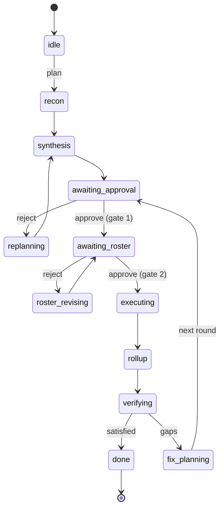

# The Command Loop

Back to [[Relay Mesh Reference]].

The operator loop is short and always the same. Run `doctor` first on any new box, then walk the phases. A bare re-run resumes from on-disk state, so there is no separate resume command.

```bash
relay-mesh doctor                         # env, key, prompts, model slugs. always first
relay-mesh plan "<goal>" --attach board.png --project ~/src/app
relay-mesh approve                        # HUMAN GATE 1 (plan)
relay-mesh roster                         # HUMAN GATE 2 (fleet), writes briefs
relay-mesh execute                        # parallel executors + monitor
relay-mesh verify                         # verdict, scaffolds a fix round on gaps
relay-mesh status | relay-mesh watch      # derived state / live fleet table
relay-mesh costs --by domain              # spend from usage.ndjson
```

`relay-mesh run "<goal>"` chains the whole loop with both interactive gates. See [[The Two Gates]] for what happens at each stop.

## The phase machine

The phase is derived purely from the filesystem, evaluated per round, first match wins. Every command starts from truth, which is why resume is just re-running.



## Command reference

| Command | Reads | Writes | Notes |
|---|---|---|---|
| `doctor` | `.env`, `profiles.json`, `prompts/`, relay root | nothing | Env, key, prompt, and root checks. When a key is set, model slugs are validated live against OpenRouter with fuzzy suggestions. `--models` prints the full model list. Run first, always. |
| `plan` | goal, attachments, project files (read only) | `goal.md`, `inputs/`, `project.json`, recon pairs, `plan.md` | Deterministic recon briefs, then four-way parallel recon (the vision profile gets attachments as image or video parts), then one planner synthesis call. `--force` replaces the goal and re-plans. |
| `approve` | `plan.md` | `plan.approval.json` | Gate 1 (`--round rNNN`, `--reject "notes"`). Requires typing `approve` (or `--yes`); `--reject` writes a rejected approval (exit 2, gate stays armed). Pins `sha256(plan.md)`. Does not write briefs. |
| `roster` | `plan.md`, `plan.approval.json`, `roster.json` if present, `profiles.json` | `roster.json` if absent, `roster.approval.json`, exec briefs | Gate 2 (`--round rNNN`, `--reject "notes"`). Re-verifies gate 1, lints the roster (hard-block, exit 1), prints the fleet table, pins `sha256(roster.json)`, and materializes worker briefs. Authors a default roster only when none exists. |
| `execute` | both approvals, both hashes, `roster.json`, briefs, project files | reports, `workspace/`, monitor files, `closure.json`, `usage/execute.json` | Re-hashes both `plan.md` and `roster.json`, refuses on any mismatch (exit 1). Fans out to the workers the roster expands to. `--area` (repeatable) is the multi-machine split seam; `--force-area` (repeatable) re-runs one area by deleting its report + workspace; `--project` points at a local checkout. |
| `verify` | goal, plan, reports, rollup | `verify/verdict.json`, `verdict.md`, next round's fix plan if unsatisfied | Strict-JSON verdict with one repair re-prompt. Unsatisfied and below `MAX_FIX_ROUNDS` scaffolds the next round. |
| `run` | everything above | everything above | Chains all phases with gates. A bare re-run resumes. |
| `status` | relay root | nothing | Derived phase and per-pair table. `--json` for machine-readable output. Exit code mirrors the phase: 3 blocked, 0 done/idle, else 2. |
| `watch` | relay root | nothing | Read-only live fleet table. Safe on any machine sharing the root. |
| `close` | reports in a pair dir | `closure.json` | Standalone deterministic roll-up for one pair. |
| `costs` | `usage.ndjson` | nothing | Token aggregation. `--by profile\|round\|model\|domain\|stage`. |

## Exit codes

Read these, do not parse prose. They are uniform across every command.

| Code | Meaning | Your move |
|---|---|---|
| 0 | success or terminal-good | proceed |
| 1 | error or misuse, including an approval hash mismatch or a roster lint block | read the three-line error, it names the fix |
| 2 | awaiting a human, a gate is pending or partial work remains | surface it to the user, do not force |
| 3 | blocked outcomes present | first-class, not a failure. Read the blocked report, clear it, re-run `execute`. See [[The Skill Pack]] for the readouts skill that handles this. |

Blocked is the one people misread. Exit code 3 means an agent held work for your clearance. Only pairs without a parseable report re-launch when you re-run, so clearing a blocker and re-running is safe and cheap.
