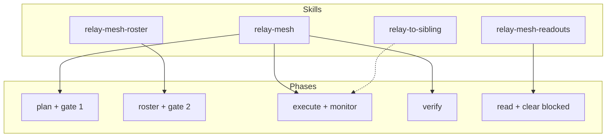

# The Skill Pack

> [!info] Back to [[Relay Mesh Reference]]

`relay-mesh-agent-skills` is an open-source, agent-agnostic skill pack that teaches any interactive coding agent (Claude Code, codex, hermes, opencode) to operate relay-mesh as an advisor and operator. It never performs worker inference itself. That is always OpenRouter, from the operator's `.env`. The skills deliberately name no model anywhere. They steer phases and slot names, not model ids. That worker-neutral design is exactly why the model mapping is operator guidance, covered in [[Steering Models Across Phases]].

## The four skills

| Skill | Purpose | Triggers when you are |
|---|---|---|
| `relay-mesh` | The operator centerpiece: the command loop, exit-code semantics, resume-by-re-run, remote-runner recipes, and the iron rule that both gates and the model choice belong to the human. | Operating a run: planning, walking the gates, executing, monitoring, verifying, closing, locally or over ssh. |
| `relay-mesh-roster` | Authoring or growing the execute fleet (`roster.json`) before gate 2: the schema, sharding and minting domains, per-domain effort, the models-lock, and the seven lint hard-blocks. | Choosing worker counts, sharding, minting domains, tuning effort, or picking model slots before the roster gate. |
| `relay-mesh-readouts` | Reading a run and acting on it: `status --json`, `verdict.json`, per-pair `closure.json`, per-domain `usage/<stage>.json`, clearing a blocked (exit 3) outcome, and cost analysis with `costs --by`. | Interpreting a run's outputs or clearing a blocked outcome. |
| `relay-to-sibling` | The cross-session boundary protocol: relay a precise question, recon brief, or execution slice to a separate agent session that owns a sibling repo, through a filesystem relay with a deterministic `closure.json`. | Working one slice when the authoritative answer or execution belongs to a repo another session owns. |

## Which skill steers which phase

`relay-mesh` is the entry point and owns the loop and the iron rules. The other two are the depth skills it points into: one for the gate 2 fleet, one for interpreting a run. `relay-to-sibling` is the companion filesystem-relay convention, and relay-mesh's per-pair `closure.json` shares its byte-compatible format.



## Install

The pack installs by symlink, so `git pull` updates the installed skills in place.

```bash
git clone git@github.com:CodeStrux/relay-mesh-agent-skills.git
cd relay-mesh-agent-skills
./install.sh                    # into ~/.claude/skills/ for Claude Code
./install.sh ~/.hermes/skills   # Hermes local skills dir
./install.sh ~/.agents/skills   # shared agent skills dir
```

Re-run `install.sh` after skills are added, renamed, or removed. It prunes dangling links. Each front-end consumes the same skills through a thin adapter note under `adapters/`. The skills are worker-neutral: the agent is a front-end, never a worker backend.

## The boundary the skills defend

> [!important]
> Every skill enforces the same contract. The advisor authors `plan.md` and `roster.json` and nothing else that the engine owns. It never writes `*.approval.json`, a report, a closure, the workspace, the monitor files, or the usage ledger. See [[The Two Gates]] for why, and [[Core Concepts]] for what each of those files is.
