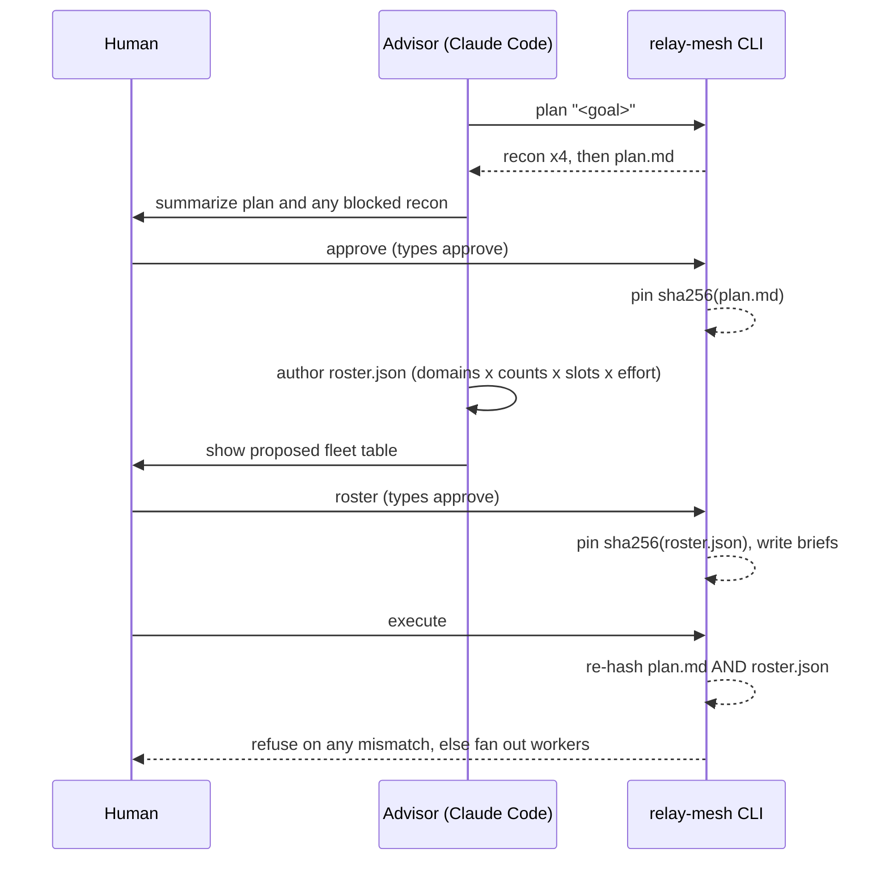

# The Two Gates

> [!info] Back to [[Relay Mesh Reference]]

Nothing executes without you, twice. The two gates are the spine of the tool's safety model, and they are also where the model choice stays in human hands. See [[Steering Models Across Phases]] for the model side.

## Gate 1, the plan

`approve` displays the plan and requires you to type `approve`. It writes `plan.approval.json` containing `sha256(plan.md)`. Want to change the plan? Edit `rounds/rNNN/plan.md`, run `approve` again. The new hash is pinned, the old approval is void. Gate 1 does not write briefs, that is gate 2's job.

## Gate 2, the roster

`roster` re-verifies gate 1, then shows the execute fleet: each domain's worker count, its persona template, and the model slot resolved through your `.env`.

```
execute fleet (models resolved from .env — the roster names only slots):
  backend: 2× exec-backend @ z-ai/glm-5.2 (BACKEND_MODEL, xhigh)
  frontend: 1× exec-frontend @ moonshotai/kimi-k2.7-code (FRONTEND_MODEL, high)
  docs: 1× exec-frontend @ moonshotai/kimi-k2.7-code (FRONTEND_MODEL, medium)
```

It lints the roster and hard-blocks on any problem: a domain with no brief, an unknown template, an inline model id or unknown slot, a reserved or duplicate domain. It requires you to type `approve`. Only then does it pin `sha256(roster.json)` and materialize the worker briefs. See [[The Skill Pack]] for the roster skill that authors this file and [[Reference Cheatsheet]] for the seven lint hard-blocks.

## The handshake



## The iron rule

> [!important]
> Both gates belong to the human, and so does the model choice. The advisor may author exactly two files, each before its gate: `rounds/rNNN/plan.md` and `rounds/rNNN/roster.json`. It never passes `--yes` unless you told it to approve, never writes an approval file, and never sets a concrete model id. It names model slots only, and models resolve from `.env`.

`execute` re-hashes both `plan.md` and `roster.json` and refuses on any mismatch (exit 1). No LLM runs between either approval and execution. The advisor can propose a plan and a roster, but it can never approve them or change a model.

The roster governs the execute stage only. Recon runs inside `plan`, before either gate, so its fleet is edited in `profiles.json` before you run `plan`.
