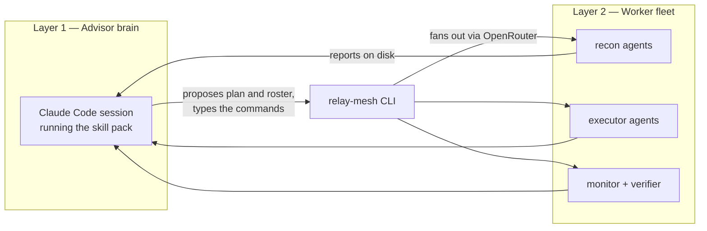

# What Is Relay Mesh

> [!info] Back to [[Relay Mesh Reference]]

relay-mesh is a parallel-workstream orchestrator for open-weight models. You give it a goal, optionally with a whiteboard photo, a diagram, or a video. It fans out four recon agents, synthesizes a plan, and stops for your approval. You then approve a roster (how many executors run, in which domains), and it runs those executors in parallel while a junior monitor watches the relay directories. A verifier checks the outcome against your goal, and if it falls short it scaffolds a fix round, back through the same two human gates.

> [!abstract] Two properties define the tool
> 1. **The filesystem is the entire state.** There is no daemon and no database. Every command derives its phase from disk. Kill any command at any moment, re-run it, and it resumes exactly where it left off.
> 2. **Worker inference is OpenRouter only.** Every worker agent is a model called through OpenRouter, paid from the operator's local `.env`. The advisor never substitutes itself for a worker.

## The two brains

This is the frame that makes the model question make sense. relay-mesh runs on two distinct kinds of intelligence, and you choose the model for each.

**Layer 1, the advisor brain.** This is your Claude Code session. It loads the skills, reads the recon output, drafts the plan and the roster, runs the CLI, and reads the results back. It does no worker inference. The model behind this session is a Claude model, and you can pick a different one for different phases. That is where Sonnet 5, Opus 4.8, and Fable 5 come in on Layer 1.

**Layer 2, the worker fleet.** These are the agents that actually do the recon, write the proposed files, monitor, and verify. Their models come only from `.env`, named by slot, resolved to OpenRouter slugs. The stock defaults are open-weight models (GLM, DeepSeek, Kimi, Gemma). OpenRouter also serves Anthropic models, so a slot can be pointed at a Claude model if you want a Claude worker.

Both layers are operator controlled. Neither the tool nor the skills hard-wire a model to a phase. See [[Steering Models Across Phases]] for the recommended mapping across both layers.

## What executors produce

Executors never touch a live repository. Each one emits complete proposed files in a fenced wire format, which land quarantined under `rounds/rNNN/workspace/<area>/files/`. You adopt the work deliberately, for example with `git diff --no-index`. Nothing is applied to your code without you. See [[Walkthrough]] for how adoption looks in practice.

## Where to go next

- [[Core Concepts]] for the vocabulary.
- [[The Command Loop]] for the commands and phases.
- [[Steering Models Across Phases]] for the model mapping.
